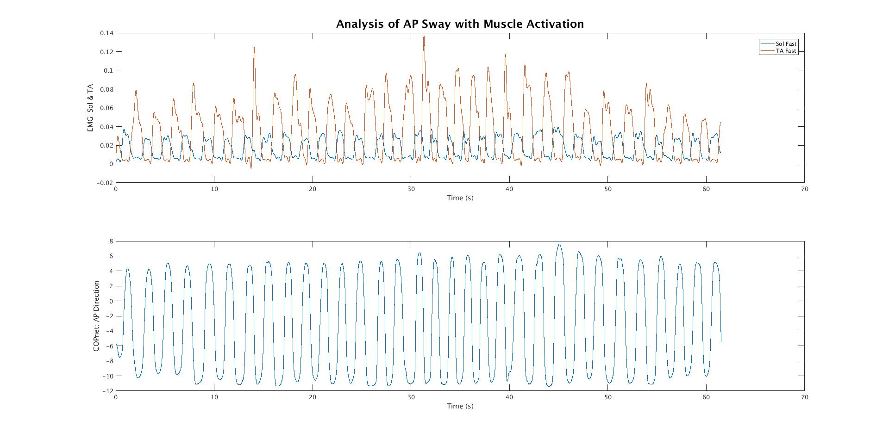
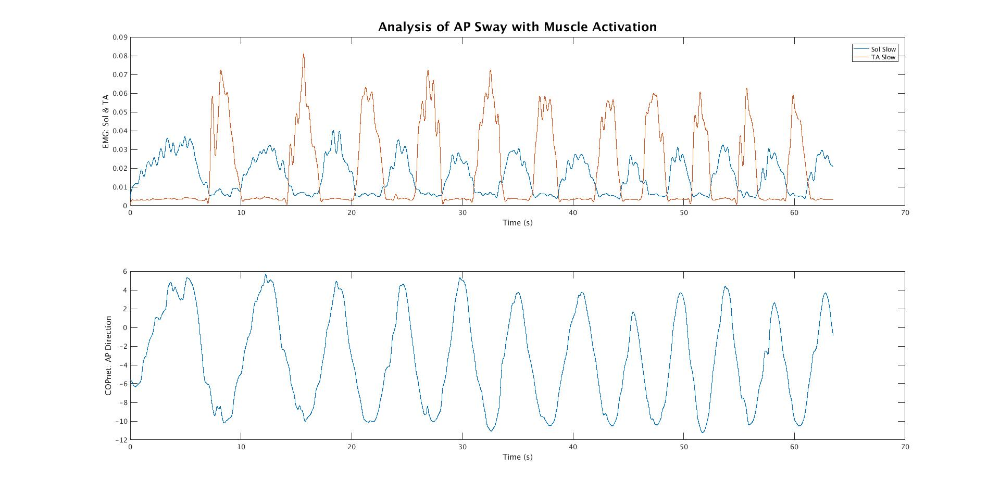

# APSwayAnalysis

Analyze physical balance and the effects of sway velocity in anterior-posterior (AP) direction. 

Note: Do not alter the 'analyzeFP2.m' file. 

Examples of some graphs which help visualize the data analysis (these graphs can aslo be found in the 'Graphs' folder of the repo) are provided below. The graphs displaying the filtration of the data are also available in the Graphs folder. 

This graph shows the simulatenous EMG data in the soleus and tibialis anterior muscles along with the sway in the AP direction for fast motion.

This graph shows the simulatenous EMG data in the soleus and tibialis anterior muscles along with the sway in the AP direction for slow motion.

